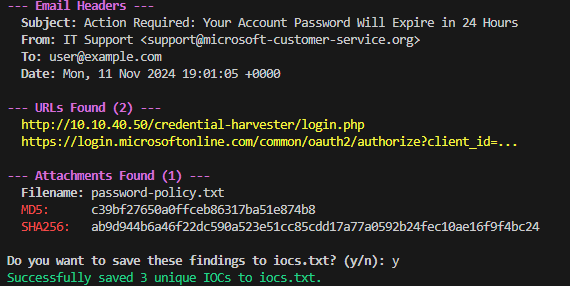

## Phishing Email Analysis Tool

This project is a Python-based command-line tool designed to automate the initial analysis of a suspicious email (.eml file). This is a core task for SOC Analyst, who is often responsible for triaging user reported phishing attempts. The script parses the raw email file to automatically extract the critical security indicators that an analyst would need for their investigation, saving valuable time and reducing manual error.

The tool is also designed to integrate with other security tools by allowing the user to export the extracted Indicators of Compromise (IOCs) to a text file.

---

### Features

- **Header Parsing:** Extracts key email headers like Subject, From, and To.

- **URL Extraction:** Scans the email body and automatically finds all embedded hyperlinks. This is crucial for identifying malicious links.

- **Attachment Hashing:** Finds all file attachments, decodes them from Base64, and calculates their MD5 and SHA256 hashes. These hashes can be used to check against threat intelligence databases.

- **IOC Export:** After analysis, the script offers to save all extracted URLs and file hashes to an iocs.txt file, which can be used as input for other scripts like an[ enrichment tool](https://github.com/P-TH/ioc-enrichment-tool).

---

### Setup & Installation

**Clone the Repository:**

    git clone https://github.com/P-TH/email-parser.git
    cd email-parser

**Create a Python Virtual Environment:**
_This creates an isolated environment for the projects dependencies._

    python3 -m venv venv
    source venv/bin/activate

---

## Usage

Run the script from your terminal, **providing the path to an .eml file as an argument.**
_A safe, realistic test file (sample.eml) is included in this repository._

    python3 parse_email.py sample.eml

_The tool will print a full analysis report to the console._

- At the end, it asks to save the findings, it will create an iocs.txt file in the project directory

---

### Sample Output:

